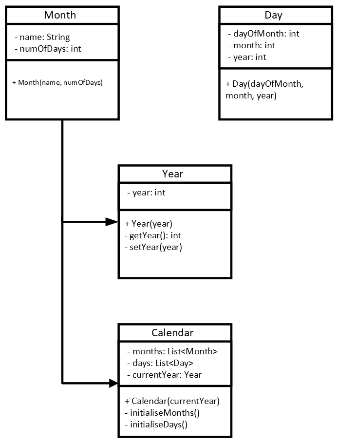

# A Calendar System in Java with OOP

In this exercise, you will begin by setting up a simple Calendar system.
Follow the UML diagram below to build the classes.

In the Main class, instantiate a calendar object.